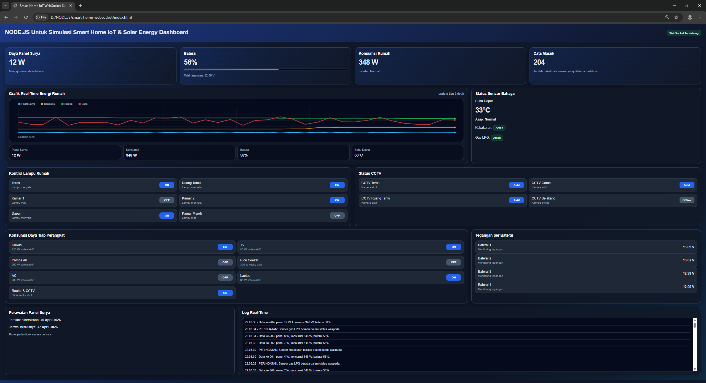
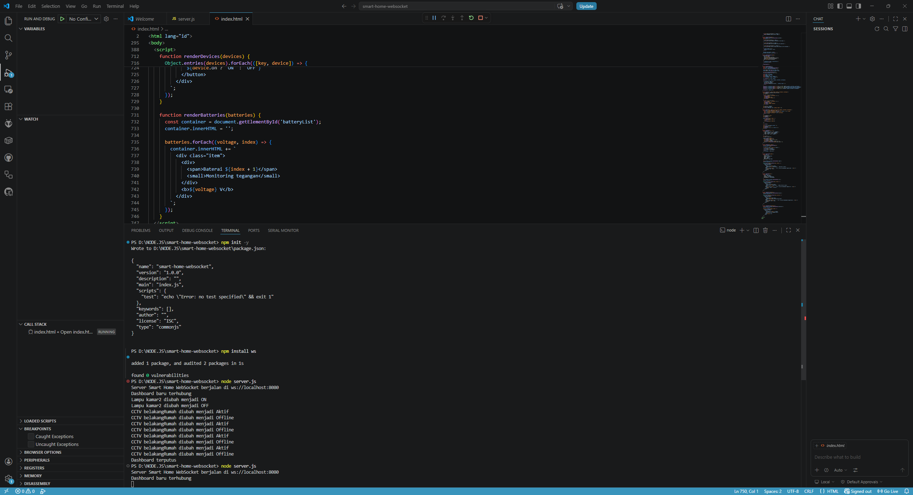
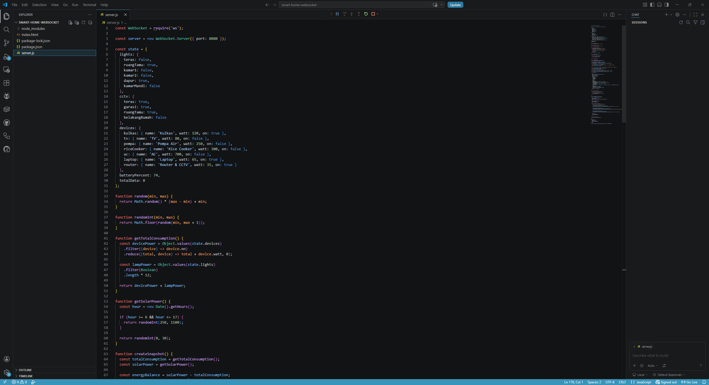
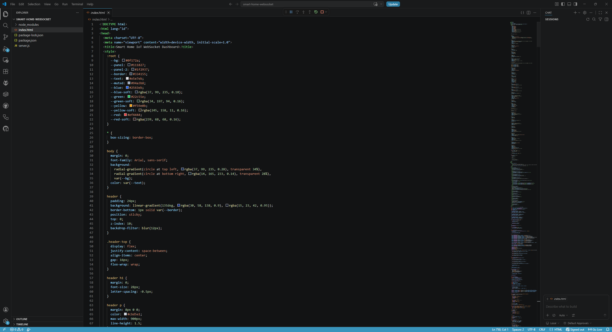

# Smart Home IoT & Solar Energy Dashboard dengan WebSocket

Proyek ini adalah eksperimen untuk mata kuliah **Pemrograman Web 2**. Aplikasi ini membuat simulasi dashboard **Smart Home IoT** dan monitoring energi surya secara real-time menggunakan **Node.js**, **WebSocket**, HTML, CSS, dan JavaScript.

Eksperimen ini dibuat untuk memahami bagaimana WebSocket dapat digunakan sebagai jalur komunikasi dua arah antara server dan browser. Server Node.js membuat data simulasi sensor/perangkat, lalu dashboard di browser menerima pembaruan data tanpa perlu refresh halaman.

## Identitas

| Keterangan | Isi |
|---|---|
| Nama | Diska Kurnia Azzahra Putra |
| NIM | 312210369 |
| Mata Kuliah | Pemrograman Web 2 |
| Topik | WebSocket |
| Studi Kasus | Simulasi Smart Home IoT dan Monitoring Energi Surya |
| Teknologi Utama | Node.js, WebSocket, HTML, CSS, JavaScript |- Nama: **Diska Kurnia Azzahra Putra**


## Tujuan Eksperimen

Tujuan dari proyek ini adalah membuat simulasi dashboard rumah pintar yang mampu menampilkan data secara real-time. Sistem ini tidak menggunakan sensor fisik, tetapi menggunakan data simulasi dari server Node.js.

Data yang disimulasikan meliputi:

- status lampu rumah,
- status CCTV,
- suhu dapur,
- status asap/kebakaran,
- level gas LPG,
- konsumsi daya perangkat elektronik,
- daya panel surya,
- tegangan baterai,
- persentase baterai,
- status inverter,
- log aktivitas real-time.

## Fitur Utama

- Monitoring daya panel surya secara real-time.
- Monitoring persentase dan tegangan baterai.
- Monitoring total konsumsi daya rumah.
- Kontrol lampu rumah ON/OFF.
- Kontrol status CCTV aktif/offline.
- Kontrol perangkat elektronik seperti TV, AC, laptop, pompa air, rice cooker, dan router.
- Sensor bahaya untuk suhu dapur, asap, dan gas LPG.
- Grafik real-time untuk energi rumah.
- Log aktivitas dan peringatan secara langsung.
- Komunikasi dua arah antara browser dan server menggunakan WebSocket.

## Teknologi yang Digunakan

- **Node.js** sebagai runtime JavaScript di sisi server.
- **ws** sebagai library WebSocket untuk Node.js.
- **HTML** untuk struktur halaman dashboard.
- **CSS** untuk tampilan dashboard dark-blue.
- **JavaScript** untuk komunikasi WebSocket dan pembaruan tampilan.
- **Google Chrome** sebagai browser pengujian.
- **Visual Studio Code** sebagai editor kode.

## Arsitektur Sistem

Alur kerja aplikasi secara sederhana:

```text
Server Node.js
    ↓
Membuat data simulasi Smart Home IoT
    ↓
Mengirim data melalui WebSocket
    ↓
Dashboard di browser menerima data
    ↓
Tampilan angka, grafik, status, dan log diperbarui otomatis
```

Selain menerima data, dashboard juga dapat mengirim perintah kembali ke server, misalnya ketika tombol lampu, CCTV, atau perangkat elektronik ditekan.

## Struktur Folder

```text
smart-home-websocket/
├── index.html
├── server.js
├── package.json
├── package-lock.json
├── README.md
├── .gitignore
└── screenshots/
    ├── dashboard-full.png
    ├── dashboard-graph.png
    ├── terminal-server.png
    ├── server-code.png
    └── index-code.png
```

## Cara Menjalankan Proyek

Pastikan Node.js sudah terpasang di komputer.

### 1. Clone repository

```bash
git clone https://github.com/USERNAME/smart-home-websocket.git
```

Masuk ke folder proyek:

```bash
cd smart-home-websocket
```

### 2. Install dependency

```bash
npm install
```

### 3. Jalankan server WebSocket

```bash
node server.js
```

Atau menggunakan script npm:

```bash
npm start
```

Jika berhasil, terminal akan menampilkan server berjalan pada alamat:

```text
ws://localhost:8080
```

### 4. Buka dashboard

Buka file `index.html` menggunakan Google Chrome.

Setelah dashboard terbuka, status WebSocket akan berubah menjadi terhubung dan data akan diperbarui otomatis.

## Cara Menguji

Beberapa pengujian yang dapat dilakukan:

1. Jalankan server dengan perintah `node server.js`.
2. Buka `index.html` di Google Chrome.
3. Tunggu beberapa detik sampai data dashboard masuk.
4. Perhatikan grafik real-time yang mulai terisi.
5. Klik tombol lampu rumah untuk mengubah status ON/OFF.
6. Klik tombol CCTV untuk mengubah status aktif/offline.
7. Klik tombol perangkat elektronik seperti TV, AC, pompa air, atau laptop.
8. Amati perubahan total konsumsi daya rumah.
9. Amati log real-time pada dashboard.

## Hasil Eksperimen

Berdasarkan pengujian, dashboard berhasil menerima data dari server secara real-time. Data seperti daya panel surya, konsumsi rumah, baterai, suhu dapur, status gas, dan log aktivitas dapat berubah tanpa perlu refresh halaman.

Pada salah satu pengujian, dashboard menampilkan:

- status WebSocket terhubung,
- data masuk lebih dari 200 paket,
- konsumsi rumah sekitar 348 W,
- baterai sekitar 57-58%,
- suhu dapur sekitar 33-34°C,
- grafik real-time berhasil menampilkan perubahan data.

Hasil ini menunjukkan bahwa WebSocket dapat digunakan untuk simulasi monitoring IoT secara langsung dari server ke browser.

## Screenshot Eksperimen

### Tampilan Dashboard

>

### Grafik Real-Time

>

### Terminal Server Node.js

>

### Kode Server

>

### Kode Dashboard

>

## Catatan

Proyek ini masih berupa simulasi. Data sensor belum berasal dari perangkat fisik seperti ESP32, Arduino, sensor DHT, sensor gas, sensor arus, atau solar charge controller. Namun, alur komunikasinya dibuat menyerupai sistem IoT, yaitu server mengirim data ke dashboard secara real-time dan dashboard dapat mengirim perintah kembali ke server.

## Pengembangan Selanjutnya

Beberapa pengembangan yang dapat dilakukan:

- Menghubungkan dashboard dengan ESP32 atau Arduino.
- Mengambil data dari sensor suhu dan kelembapan asli.
- Menggunakan sensor gas MQ-2 atau MQ-5.
- Menggunakan sensor arus dan tegangan untuk panel surya.
- Menambahkan database untuk menyimpan riwayat data.
- Menambahkan login pengguna.
- Menggunakan koneksi aman `wss://` untuk penerapan produksi.

## Lisensi

Proyek ini dibuat untuk kebutuhan pembelajaran dan tugas mata kuliah Pemrograman Web 2.
